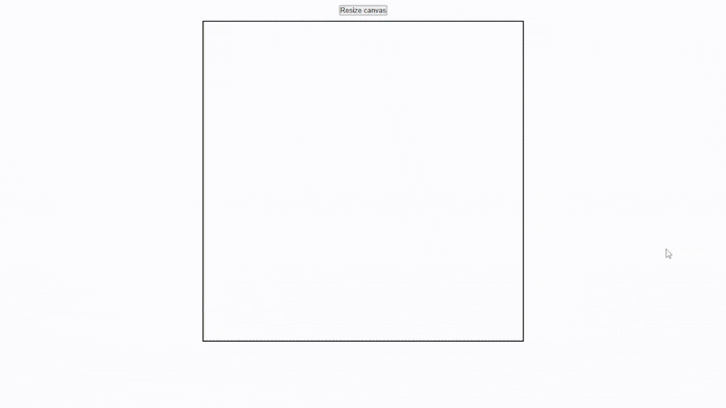

# Odin Project - Etch-a-Sketch

This is a project made to the [Odin Project Foundations Path](https://www.theodinproject.com/lessons/foundations-etch-a-sketch). Status: Completed.

## Screenshot

## About

A blank canvas where you can draw in it. Made with basic HTML, CSS and JavaScript.

## Links

- Live Site URL: [Github Pages](https://luizhen527.github.io/etch-a-sketch/)

<!-- - [Example resource 1](https://www.example.com) - This helped me for XYZ reason. I really liked this pattern and will use it going forward.
- [Example resource 2](https://www.example.com) - This is an amazing article which helped me finally understand XYZ. I'd recommend it to anyone still learning this concept. -->

## Author

- Linkedin - [@luizhen765](https://www.linkedin.com/in/luizhen765/)